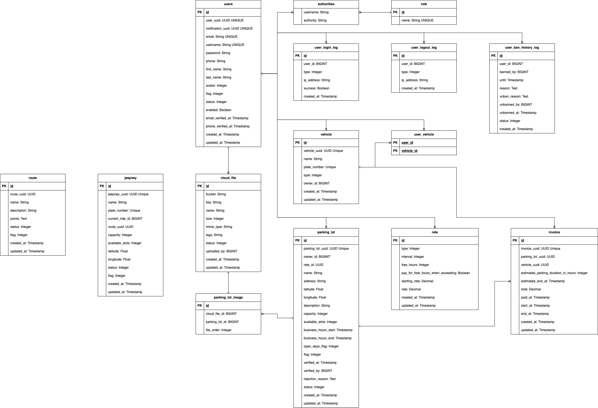

# Parking Backend Spring

## Table of Contents

- [Project Description and Structure](#project-description-and-structure)
- [Project Terminologies](#project-terminologies)
- [Tech Stack](#tech-stack)
- [Getting Started](#getting-started)
    - [Step 1: Clone the repository](#step-1-clone-the-repository)
    - [Step 2: Set Up Docker](#step-2-set-up-docker)
    - [Step 3: Configure Environment Variables](#step-3-configure-environment-variables)
    - [Step 4: Add "dev" as a Spring Boot Profile](#step-4-add-dev-as-a-spring-boot-profile)
    - [Step 5: Run Maven Clean Install](#step-5-run-maven-clean-install)
    - [Step 6: Set Up the Database with Flyway](#step-6-set-up-the-database-with-flyway)
    - [Step 7: Seed the Database with DbUnit](#step-7-seed-the-database-with-dbunit)
    - [Step 8: Run the Main Class](#step-8-run-the-main-class)
    - [Done!](#done)
    - [OPTIONAL STEP: Test GitHub Actions Locally with Act](#optional-step-test-github-actions-locally-with-act)

## Project Description and Structure

This repository contains the backend for the ChatChatABC parking system. The backend system currently contains 4
modules developed using `Spring Boot` and written with `Java` and `Kotlin` and follows `Domain Driven Design`. The
project follows a `monorepo` structure where all the modules are contained in a single repository.

- `Parking API` [(parking-api)](parking-api)

  This module is a `Spring Boot` application. It contains the REST API for the Parking Owners and Parking Users. It is
  primarily written in `Kotlin`. It is capable of providing authentication and authorization to owners and users.

  This module is dependent on the `Parking Domain` and `Parking Web Common` module.

- `Parking Admin` [(parking-admin)](parking-admin)

  This module is also a `Spring Boot` application. It also contains the REST API and GraphQL endpoints for the Parking
  Admin. It is also primarily written in `Kotlin`. It is capable of providing authentication and authorization to
  admins.

  This module is dependent on the `Parking Domain` and `Parking Web Common` module.

- `Parking Domain` [(parking-domain)](parking-domain)

  This module is a `Java` shared library. It contains the domain models and business logic for the Parking System. The
  entire project is dependent on this module.

- `Parking Web Common `[(parking-web-common)](parking-web-common)

  This module is a `Java` shared library. It contains the common web components for the Parking System such as the
  [JwtService.java](parking-web-common/src/main/java/com/chatchatabc/parking/web/common/application/rest/service/JwtService.java)
  and its implementation and the configuration for
  the [Spring Security](parking-web-common/src/main/java/com/chatchatabc/parking/web/common/application/config/security/SecurityConfig.java).

## Project Terminologies

- `Users`: Refers to the users of the system. They can be assigned with any role.
- `Roles`: Refers to the roles a `user` can have. The project current supports the following roles:
    - `Parking Owners`: Refers to the owners of the parking lots. They can register a parking lot. NOTE: An owner
      account can only have one registered parking lot. Please see this repository for
      the [Parking Owner Mobile Application](https://github.com/chatchatabc/parking-mobile-kmm)
    - `Parking Users`: Refers to the base users of the Parking System. Please see this repository for
      the [Parking User Mobile Application](https://github.com/chatchatabc/parking-mobile-kmm)
    - `Parking Admins`: Refers to the admins of the Parking System. They access the admin dashboard through a separate
      web application. Please see this repository for
      the [Parking Admin Dashboard](https://github.com/chatchatabc/parking-admin-react)
    - `Parking Enforcers`: Refers to the government entities that has access to the Parking System. They can review and
      perform actions based on the `Reports` generated by the `users` and `parking owners`.
- `Parking Lots`: Refers to the parking lots registered by the `parking owners`. A parking lot has to be verified for it
  to appear publicly on the map.
- `Vehicles`: Refers to the vehicles of the `users`. A `user` can own and have access to multiple vehicles.
- `Invoices`: Refers to the invoices generated by the `parking owners` for the `users`. The `users` can pay the
  invoices through the `user mobile application` or other preferred payment methods.
- `Reports`: Refers to the reports generated by the `users` and `parking owners`. Anyone can report any traffic or
  vehicle related violations. The reports will then be visible to the `enforcers` for review and action.

## Tech Stack

This project is built using a variety of tools, libraries, and technologies. Listed below are the major ones:

- Languages:
    - [Java 17](https://docs.oracle.com/en/java/)
    - [Kotlin 1.8](https://kotlinlang.org/docs/home.html)
- Framework:
    - [Spring Boot 3.1.0](https://mvnrepository.com/artifact/org.springframework.boot/spring-boot/3.1.0)
- Technologies:
    - [NATS](https://nats.io/)
    - [Aliyun OSS](https://www.alibabacloud.com/product/oss)
- Build Tool:
    - [Maven 3.8.1](https://maven.apache.org/guides/index.html)
- API:
    - [GraphQL](https://graphql.org/)
    - [REST](https://restfulapi.net/)
- Authentication and Authorization:
    - [JWT](https://jwt.io/)
    - [Spring Security](https://spring.io/projects/spring-security)
- Database:
    - [PostgreSQL 15.2](https://www.postgresql.org/docs/15/index.html)
    - [Redis 7.0.11](https://redis.io/documentation)-
- Libraries:
    - [Spring Data JPA](https://spring.io/projects/spring-data-jpa)
    - [Spring Boot Actuator](https://docs.spring.io/spring-boot/docs/current/reference/html/actuator.html)
    - [Swagger UI](https://swagger.io/tools/swagger-ui/)
    - [Quartz Scheduler](https://www.quartz-scheduler.org/)
    - [Hibernate](https://hibernate.org/)
    - [MapStruct](https://mapstruct.org/)
    - [Lombok](https://projectlombok.org/)
- Testing and Tools:
    - [JUnit 5](https://junit.org/junit5/docs/current/user-guide/)
    - [Testcontainers](https://www.testcontainers.org/)
    - [Flyway](https://flywaydb.org/documentation/)
    - [DBUnit](http://dbunit.sourceforge.net/)
    - [DBRider](https://database-rider.github.io/database-rider/latest/documentation.html?theme=foundation)
- CI/CD
    - [GitHub Actions](https://docs.github.com/en/actions)
- Containerization
    - [Docker](https://docs.docker.com/)
    - [Docker Compose](https://docs.docker.com/compose/)

## Getting Started

To set up and run this project locally, follow the steps below:

### Step 1. Clone The Repository

First, you need to clone this project. Open a terminal window and run the following command:

``` shell
git clone https://github.com/chatchatabc/parking-backend-spring.git
```

### Step 2. Set Up Docker

This project uses [Docker](https://docs.docker.com/get-docker/) for containerization.
Install [Docker](https://docs.docker.com/get-docker/) and [Docker Compose](https://docs.docker.com/compose/install/)
if you haven't done so yet.

Once Docker and Docker Compose are installed, navigate to the project directory and start the services defined in
[docker-compose.yml](docker-compose.yml):

```shell
cd parking-backend-spring
docker-compose up
```

### Step 3: Configure Environment Variables

Create a `.env.properties` file in the root of your project and input your Aliyun OSS credentials like so:

```properties
### oss
aliyun.region.id=ap-southeast-6
aliyun.access.key=YourAccessKeyId
aliyun.access.secret=YourAccessKeySecret
aliyun.oss.bucket-name=YourBucketName
aliyun.oss.endpoint=YourEndpoint
```

Replace `YourAccessKeyId`, `YourAccessKeySecret`, `YourBucketName`, and `YourEndpoint` with your actual credentials.

### Step 4: Add "dev" as a Spring Boot Profile

To set up your Spring Boot profile for development, configure your IDE to use `dev` as the active profile or add
`-Dspring.profiles.active=dev` to your VM options.

### Step 5: Run Maven Clean Install

This project uses MapStruct, which requires code generation before running the application. To generate the
implementation classes, run the following command in the root directory of the project:

```shell
mvn clean install

```

NOTES:

- Adding more MapStruct mappers may require you to run `mvn clean install` again.
- Implementations are generated in the `target/generated-sources/annotations` directory.

### Step 6: Set Up the Database with Flyway

Flyway is used in this project for database migrations. After installing all the project dependencies, it's time to set
up the database schema. Navigate to the parking-domain module, and run the following commands in the terminal:

```shell
cd parking-domain
mvn flyway:clean
mvn flyway:migrate
cd ..

```

This will clean any existing schema and migrate the latest version of the schema to your database.

NOTE: IF you are using IntelliJ IDEA, you can also run the Flyway migrations through the Maven tab.

### Step 7: Seed the Database with DbUnit

DbUnit is used in this project to seed initial data into the database. Still in the parking-domain module, run the
DbUnit operation to load the seed data:

```shell
cd parking-domain
mvn dbunit:operation

```

### Step 8: Run the Main Class

To run the application, navigate to the main class of either the API or Admin module and run it:

```shell
cd parking-api # or parking-admin, depending on which module you want to run
mvn spring-boot:run

```

NOTE: If you are using IntelliJ IDEA, you can also run the application using the IDE's built-in run configuration.

### Done!

At this point, your application should be running locally. By default `Parking API` should be running
on http://localhost:5080 (or whichever port you configured) to verify the application is running correctly.
Meanwhile, `Parking Admin` should be running on http://localhost:5180 (or whichever port you configured).

Enjoy exploring and contributing to the Parking Backend Spring project!

## OPTIONAL STEP: Test GitHub Actions Locally with Act

[Act](https://github.com/nektos/act) is a tool that enables you to run your GitHub Actions workflows locally. This can
be particularly helpful for testing your workflows before pushing them to your GitHub repository. In this case, we use
it to local test deployment workflows.

Follow these steps to run your workflows locally using Act:

1. Install Act: Follow the [installation instructions](https://github.com/nektos/act#installation) on the Act GitHub
   page to install Act on your machine.

2. Run Act: Once Act is installed, you can use it to run your workflows. In this project, use the following command to
   run the act-build job:

```shell
act -j act-build -r

```

The -j option specifies the job to run (in this case, act-build). The -r option makes Act use the real size for the
Docker image, which is important since the image used in this project is large.

## Diagrams and Flowchart

### Entity Relationship Diagram



### Flowchart


# References

* [Parking Admin Dashboard Repository](https://github.com/chatchatabc/parking-admin-react)
* [Parking Mobile App Repository](https://github.com/chatchatabc/parking-mobile-kmm)
* [Spring Boot 3.1.0](https://mvnrepository.com/artifact/org.springframework.boot/spring-boot/3.1.0)
* [Java 17](https://docs.oracle.com/en/java/)
* [Kotlin 1.8.21](https://kotlinlang.org/docs/home.html)
* [NATS](https://nats.io/)
* [Aliyun OSS](https://www.alibabacloud.com/product/oss)
* [Maven 3.8.1](https://maven.apache.org/guides/index.html)
* [GraphQL](https://graphql.org/)
* [REST](https://restfulapi.net/)
* [JWT](https://jwt.io/)
* [Spring Security](https://spring.io/projects/spring-security)
* [PostgreSQL 15.2](https://www.postgresql.org/docs/15/index.html)
* [Redis 7.0.11](https://redis.io/documentation)
* [Spring Data JPA](https://spring.io/projects/spring-data-jpa)
* [Spring Boot Actuator](https://docs.spring.io/spring-boot/docs/current/reference/html/actuator.html)
* [Swagger UI](https://swagger.io/tools/swagger-ui/)
* [Quartz Scheduler](https://www.quartz-scheduler.org/)
* [Hibernate](https://hibernate.org/)
* [MapStruct](https://mapstruct.org/)
* [Lombok](https://projectlombok.org/)
* [JUnit 5](https://junit.org/junit5/docs/current/user-guide/)
* [Testcontainers](https://www.testcontainers.org/)
* [Flyway](https://flywaydb.org/documentation/)
* [DBUnit](http://dbunit.sourceforge.net/)
* [DBRider](https://database-rider.github.io/database-rider/latest/documentation.html?theme=foundation)
* [GitHub Actions](https://docs.github.com/en/actions)
* [Docker](https://docs.docker.com/)
* [Docker Compose](https://docs.docker.com/compose/)
* [Act](https://github.com/nektos/act)

[//]: # (jbang)

[//]: # (``` shell)

[//]: # (mvn -DdbHost=${$&#40;docker compose port postgres 5432&#41;#*:})

[//]: # (```)