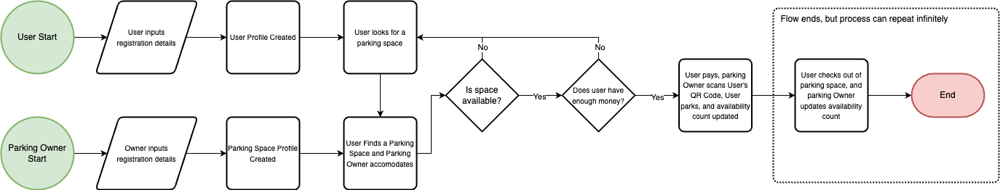
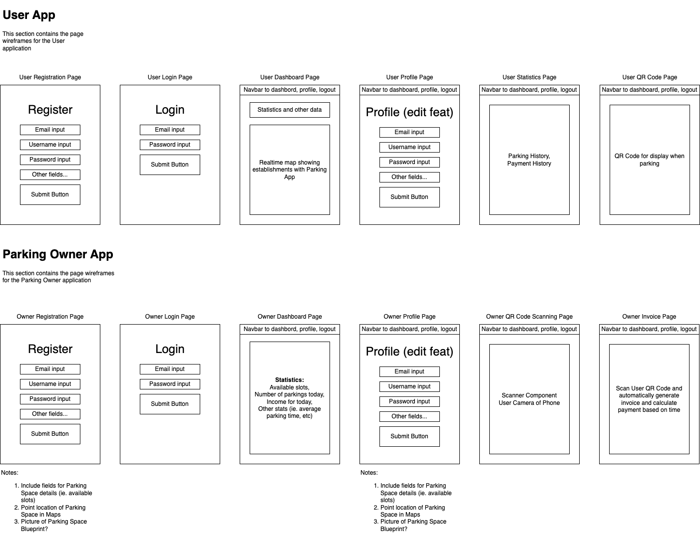

# ParkingABC Demo

This repository showcases a demo using `Kotlin Multiplatform Mobile` and `Kotlin Spring Boot`. This demo can also be
used as template for future projects needing `Android and iOS` implementation.

## Diagrams and Flowchart

### Flowchart

### UI Wireframe

## Goals

- Parking Demo
    - One instance acting as parking sensor
    - One instance acting as user
- Real Time Map
- Spring Boot Backend
    - User Authentication
    - Parking Sensor Registration

## TODOs

- [x] Flowchart
- [x] UI Wireframe
- [ ] Entity Relationship Diagram
- [ ] User App
    - [ ] Android App
    - [ ] iOS App
- [ ] Parking Owner App
    - [ ] Android App
    - [ ] iOS App