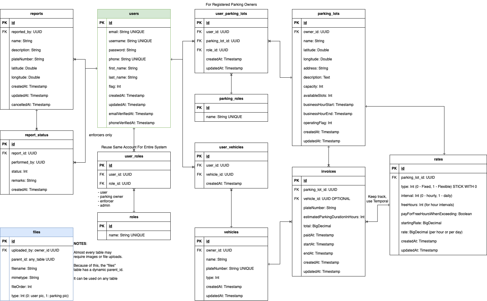

# ParkingABC Demo

This repository showcases a demo using `Kotlin Multiplatform Mobile` and `Kotlin Spring Boot`. This demo can also be
used as template for future projects needing `Android and iOS` implementation.

## Diagrams and Flowchart

### Entity Relationship Diagram

### Flowchart

## Goals

- Two Apps
    - User App
    - Parking Owner App
- QR Code Scanning
- Invoicing
- Real Time Map
- Spring Boot Backend

## TODOs

- [x] Flowchart
- [x] UI Wireframe
- [x] Entity Relationship Diagram
- [ ] Redis
    - [ ] for Forgot Password
    - [ ] for OTP
- [ ] User App
    - [ ] Android App
    - [ ] iOS App
- [ ] Parking Owner App
    - [ ] Android App
    - [ ] iOS App
- [ ] Spring Boot Backend
    - [x] User Registration
    - [x] Owner Registration
    - [x] Authentication
    - [ ] Logout (just delete token?)
    - [x] Vehicle API
    - [x] Parking Lot API
    - [x] Invoicing API
    - [ ] Scanning of QR Code
    - [ ] Real Time Map

- do not extend to spring frame on main pom
- rename parent to parent (parking parent)
- version then packaging
- rename description
- utf-8 encoding
- ====
- sequence of plugins for pom
- compiler first on build
- maven surefire testing plugin
- packaging
- ====
- add scm git to pom
- add developer information to pom
- use gitignore.io
- for dockercompose use postgres as root name since it is default
- use same password for postgres
- use specific version when starting development
- use maven site plugin for documentation (src site)
- adminBaseUrl
- userBaseUrl
- local or dev
- dont commit .env private
- use 80 ports for servers (because it means web), dont use plain 5000
- add actuator dependency to pom file
- arrange structure of pom file always
- always use master packages for stability and less bugs
- always update your pom packages (use "just")
- move http files to correct folder
- move .mvn to root folder
- remove unnecessary files if already on root
- use flyway for init of data (dont use init or data init)
- unit tests on domain
- chatchatabc.parking.api and admin
- move infra to application
- no infra on hexagon domain driven design, use adapter instead. or rename to service
- no need for domain on hexagonal projects
- rename DomainConfig to "Configuration" but DomainConfig is fine for now. find a better spring boot project name
- ask audrey to help make the unit test for parking project
  - database track
  - test container
  - spring boot test
  - mvc test
  - db test
- use one index.http file for all http requests
- create parking-web-common module for same jwt
- make code n00b friendly